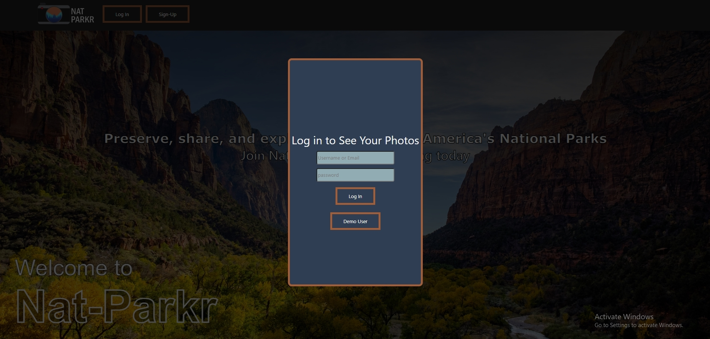
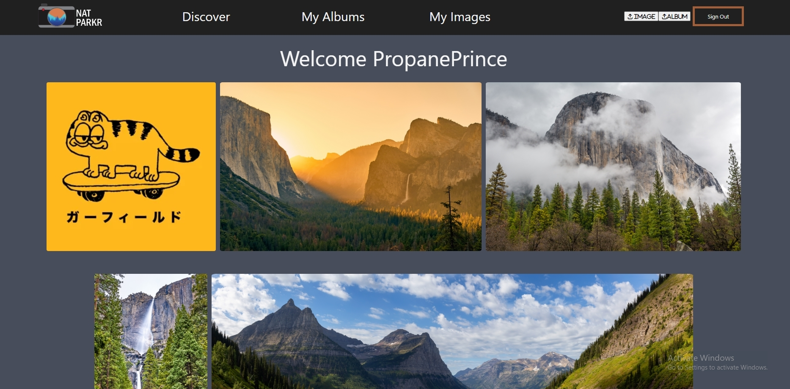
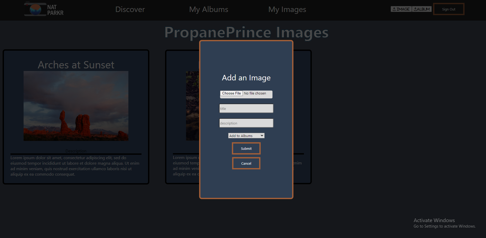
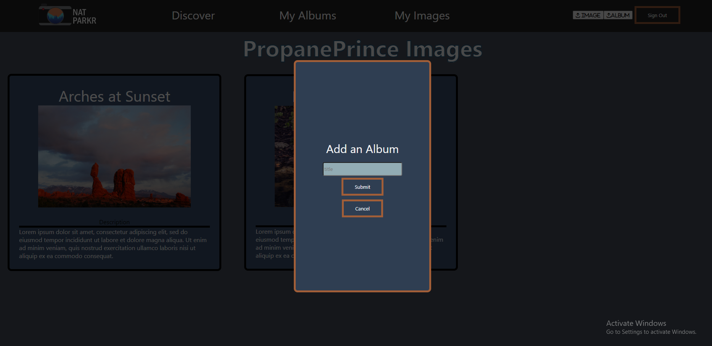
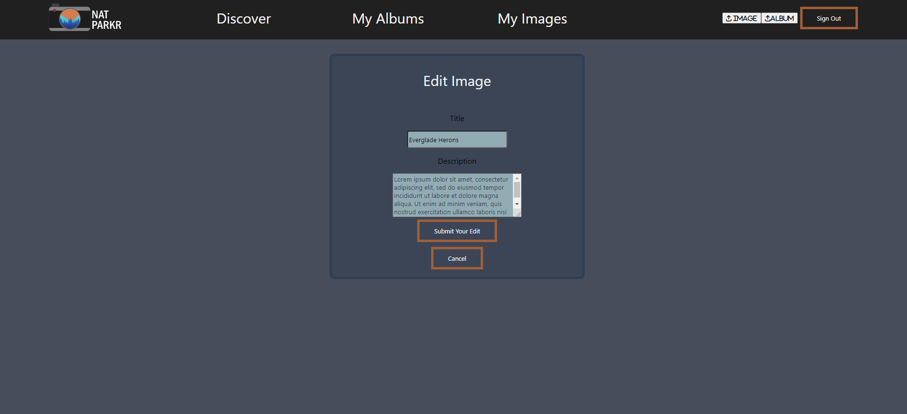
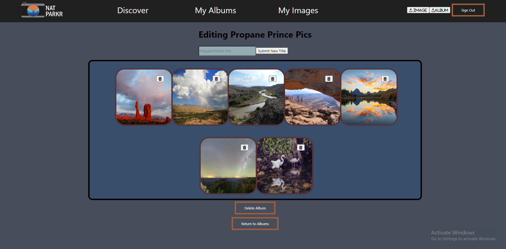
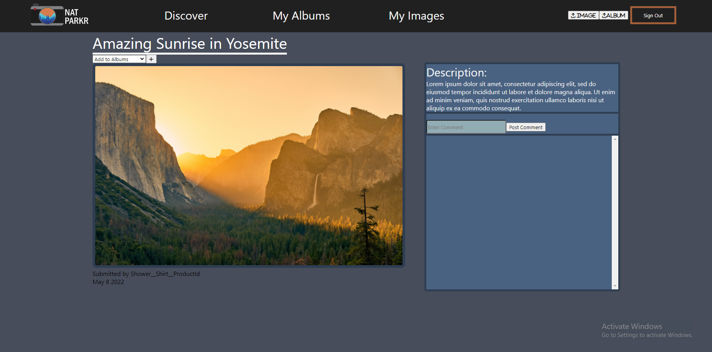

# Nat-Parkr

Nat-Parkr Live Link: https://nat-parkr.herokuapp.com/

Git wiki : https://github.com/ChrisThreadgill/TaskBeaver

### Contact

## Nat-Parkr

---

NatPark

Nat-Park is a clone of Flickr with an emphasis on sharing images of national parks. Logged users can upload images, create albums for images as well as add comments to other users images.

## Build Instructions

---

1. You will need to download the repo and open it in VScode
2. Cd into the backend folder and run `npm install` to install all required dependencies for backend server. Cd into frontend folder and `npm install` to install all required dependencies for the frontend sever.
3. In the root folder, create a '.env' file and use the '.env.example' file as a reference (you may copy and paste and use your own data)
4. Once set up your postgress user and db migrate all tables and seeders
5. In your terminal, run `npm start` on the back end and then run `npm start` in your front end at the same time.

## Technologies Used

---

## Nat-Parkr Features

##

### Login and Sign-up form

### Image Discover Page

### Image upload and Album creation

### Edit Image and Edit Album

### Single Image Show with Comments

## Future Features

---

- Implement location tag feature
- Implement search feature with ability to search picture titles or locations
- Implement map feature to display location on each park
- Implement user profiles
- Implement navigation between pictures
